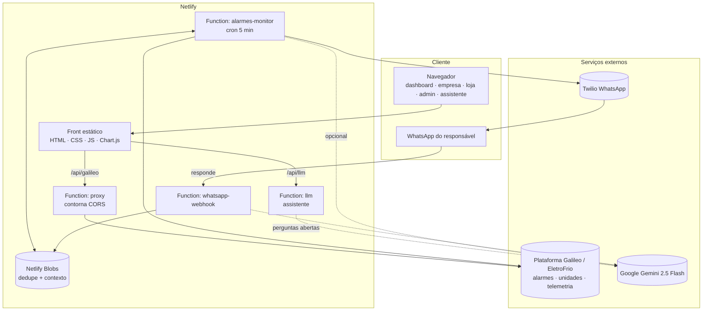
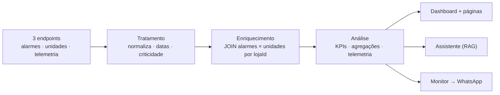
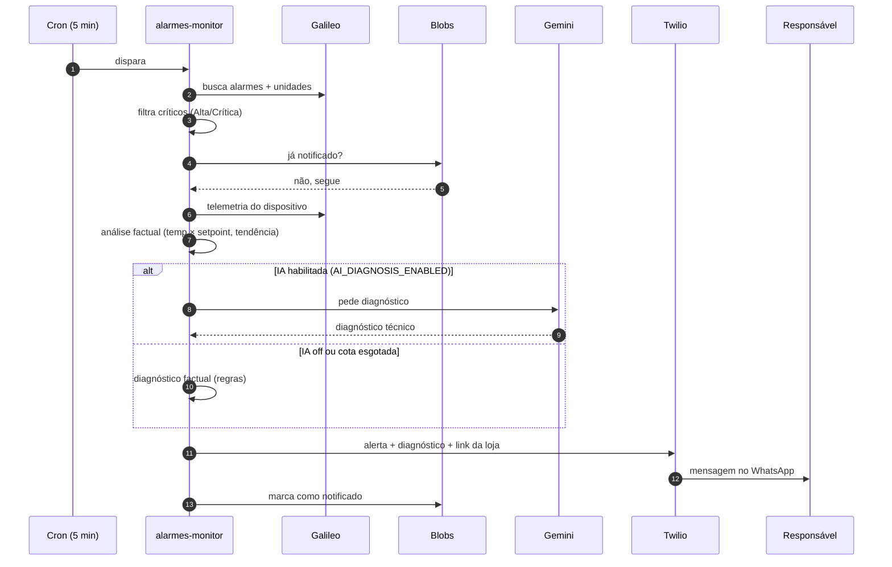
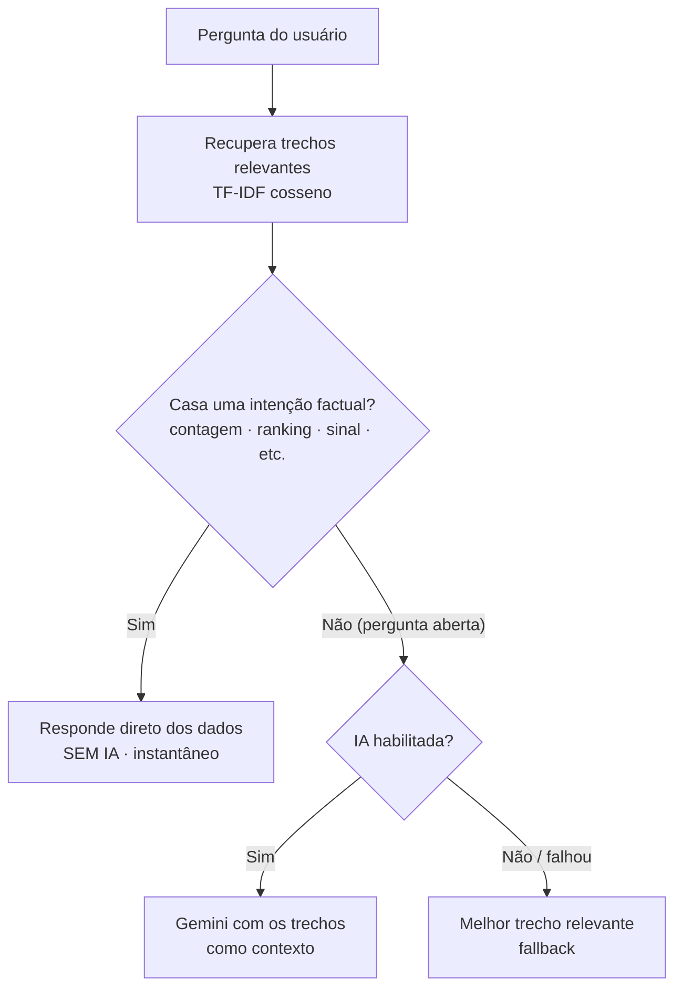

# Freezer Controle

**Sistema de monitoramento, previsão de falhas e gestão contratual para
refrigeração comercial.**

> Interface implantada sob a marca **Freezer Controle** (nome interno do
> projeto: *Galileo Watch*). O sistema consome a plataforma
> **Galileo (EletroFrio)**.

Freezer Controle unifica os dados operacionais e contratuais da plataforma
Galileo (EletroFrio) em um console único: consome alarmes, cadastro de
unidades e telemetria de equipamentos em tempo real, cruza essas fontes, e
entrega indicadores, visualizações, um assistente em linguagem natural e
**notificação proativa via WhatsApp** quando um alarme crítico é detectado.

**Produção**: https://radiant-sunburst-1294db.netlify.app/
**Inspeção de dados**: https://radiant-sunburst-1294db.netlify.app/debug.html

---

## Sumário

- [Contexto e problema](#contexto-e-problema)
- [Questão de pesquisa](#questão-de-pesquisa)
- [Objetivo geral](#objetivo-geral)
- [Objetivos específicos](#objetivos-específicos)
- [Justificativa](#justificativa)
- [Contexto de aplicação](#contexto-de-aplicação)
- [Arquitetura](#arquitetura)
- [Funcionalidades](#funcionalidades)
- [Estrutura do projeto](#estrutura-do-projeto)
- [Execução local](#execução-local)
- [Variáveis de ambiente](#variáveis-de-ambiente)
- [Deploy](#deploy)
- [Maturidade e roadmap](#maturidade-e-roadmap)
- [Stack](#stack)

---

## Contexto e problema

A operação de refrigeração comercial é silenciosa quando funciona e
catastrófica quando falha. Câmaras frigoríficas, expositores e ilhas de
congelados de um supermercado armazenam centenas de milhares de reais em
produto perecível, e a janela de tolerância entre "alarme disparado" e
"produto perdido" pode ser de poucas horas — às vezes minutos para itens
como sorvete e açougue.

A plataforma Galileo entrega dados ricos sobre essa operação: ocorrências
em tempo real, cadastro contratual das unidades e séries temporais por
dispositivo. O problema é que esses dados chegam em **três fontes
heterogêneas, sem correlação direta no momento da entrega**, dificultando
que um operador responda em segundos a perguntas como:

- Quais lojas têm alarmes graves agora e qual o impacto contratual delas?
- Existem dispositivos sinalizando comportamento anômalo antes do alarme
  oficial?
- Quais contratos estão a vencer **e** apresentam histórico de alarmes
  recentes?

E, criticamente: **o operador precisa ser avisado no momento em que o
problema acontece**, não apenas quando abre o painel.

## Questão de pesquisa

> Como antecipar falhas em equipamentos de refrigeração monitorados,
> notificar responsáveis em tempo real e priorizar intervenções
> considerando o contexto contratual de cada unidade, reduzindo perda de
> produto perecível e tempo de indisponibilidade?

## Objetivo geral

Desenvolver um sistema de monitoramento e suporte à decisão que unifique
os dados operacionais e contratuais da plataforma Galileo, permitindo a
antecipação de falhas, a identificação de anomalias em telemetria, a
notificação proativa de ocorrências críticas e a priorização de
intervenções com base no risco real para o negócio.

## Objetivos específicos

1. **Previsão de Falhas** — antecipar a ocorrência de falhas em
   equipamentos de refrigeração analisando o comportamento histórico
   recente de variáveis críticas (temperatura ambiente, setpoint,
   acionamentos de degelo) e identificando padrões precursores antes do
   disparo do alarme oficial.

2. **Identificação de Anomalias** — detectar desvios de comportamento em
   séries temporais de telemetria que fujam da operação normal de cada
   dispositivo (drift de setpoint, oscilação fora da banda estatística,
   períodos prolongados sem sinal de vida) e sinalizá-los visualmente ao
   operador.

3. **Priorização Inteligente de Intervenções** — combinar criticidade do
   alarme, janela de vencimento contratual e tempo desde o último sinal
   de vida em um score único de risco por loja, produzindo um ranking
   objetivo de onde a operação deve agir primeiro, em vez de tratar todos
   os alarmes com igual prioridade.

## Justificativa

A indisponibilidade de equipamentos de refrigeração em um supermercado
tem três custos diretos sobrepostos:

- **Perda de produto** — perecíveis (cárneos, laticínios, congelados,
  hortifrúti) descartados quando a cadeia do frio é rompida. Em uma câmara
  de médio porte, isso pode ultrapassar dezenas de milhares de reais em
  poucas horas.
- **Risco sanitário e regulatório** — produtos comercializados fora da
  curva de temperatura adequada expõem o consumidor e a rede a sanções da
  Vigilância Sanitária.
- **Custo operacional reativo** — atendimento técnico de emergência é
  significativamente mais caro do que manutenção planejada.

Reduzir o tempo entre o início de uma anomalia e a intervenção
qualificada — ou antecipar uma falha pela leitura de seus precursores —
gera retorno mensurável. É nesse vão que o Freezer Controle atua:
transformar dado bruto da plataforma em **ação priorizada e notificada**.

## Contexto de aplicação

O sistema foi desenhado para uso em **centros de operação (NOC) e equipes
de monitoramento remoto** que acompanham várias unidades em paralelo. Os
perfis de usuário:

- **Operadores de monitoramento** — precisam de um painel onde
  identifiquem em segundos onde há fogo, e de alertas que cheguem ao
  celular sem precisar estar com o painel aberto.
- **Coordenadores comerciais** — precisam cruzar a saúde operacional com a
  janela contratual para conversar com o cliente.
- **Equipes técnicas de campo** — precisam de priorização clara para
  rotear deslocamentos.

A interface foi pensada para uso primário em desktop de NOC (1080p+) e é
responsiva para tablets e celulares. As notificações chegam por WhatsApp.

---

## Arquitetura

O front é um site estático; toda a lógica de servidor (proxy, IA, envio de
WhatsApp, cron) vive em **Netlify Functions**. Nenhuma chave de API trafega
pelo navegador.



### Fluxo de dados

O pipeline informacional segue **ingestão → tratamento → enriquecimento →
análise → (assistente | notificação)**.



### Pipeline de alerta proativo

A cada 5 minutos o monitor procura alarmes críticos novos, analisa a
telemetria do equipamento e notifica o responsável com um diagnóstico.



### Assistente factual-first

O assistente prioriza respostas factuais (direto dos dados) e só recorre à
IA para perguntas abertas — economiza cota e evita alucinação.



---

## Funcionalidades

### Páginas e navegação

O sistema é multi-página, refletindo o fluxo de investigação do operador:

- **Dashboard** (`index.html`) — visão geral: 4 indicadores (empresas
  monitoradas, lojas, alarmes nos últimos 30 dias, alarmes críticos),
  gráfico de **alarmes por empresa** (barras empilhadas: críticos × demais),
  faixas de **parâmetros de temperatura** de referência por tipo de
  equipamento, busca e a lista de empresas. Inclui o assistente.
- **Empresa** (`empresa.html`) — todas as lojas de uma empresa; cada cartão
  traz contrato, pedido, endereço, telefone, sinal de vida e contagem de
  alarmes.
- **Loja** (`loja.html`) — as máquinas monitoradas da loja: por equipamento,
  exibe a **telemetria** (temperatura × setpoint) e um **diagnóstico
  factual** automático (temperatura atual, desvio, tempo acima do setpoint,
  tendência).
- **Admin** (`admin.html`) — central operacional com **todos os alarmes
  ativos** em tabela: filtros por criticidade, busca, ordenação (críticos e
  mais antigos primeiro) e **exportação CSV**.

Toda a interface é **responsiva** (no celular a tabela do Admin vira
cartões e os gráficos se adaptam).

### Ingestão e tratamento

- Coleta dos três endpoints (alarmes, unidades, telemetria).
- Normalização: trim de strings (resolve `"Afonso Pena "`,
  `" Cema Patrocínio"`), parse de datas (ISO e brasileiro), coerção
  numérica com vírgula decimal.
- Mapeamento de criticidade (`C` → Crítica, `A` → Alta, `M` → Média,
  `B` → Baixa, `I` → Informativa).
- Descarte automático dos valores nulos do fim das séries de telemetria.
- Dedupe por `alarmeId` e por `lojaId+contaId`.
- Enriquecimento via JOIN alarmes × unidades.

### Assistente inteligente (factual-first)

O assistente do dashboard responde sobre a operação combinando recuperação
de informação e IA, **priorizando respostas factuais**:

- **Camada factual (regras, sem IA)** — perguntas comuns (quantos
  alarmes/críticos, ranking de lojas/empresas, distribuição por
  criticidade, lojas sem sinal de vida, contratos a vencer, telemetria,
  alarmes de uma empresa/loja específica, saudação) são respondidas
  **direto dos dados estruturados**, na hora, sem consumir cota de IA.
- **Recuperação (retrieval)** — chunking textual + TF-IDF cosseno seleciona
  os trechos mais relevantes.
- **Geração (IA)** — só para **perguntas abertas/analíticas**, o Gemini 2.5
  Flash responde com os trechos como contexto (chave protegida em variável
  de ambiente).
- **Fallback** — sem IA disponível, recai para o melhor trecho relevante.
  O sistema nunca fica sem resposta.
- **Chips de perguntas sugeridas** facilitam o uso; cada resposta indica
  sua origem (regras/IA) e os trechos-fonte.

### Notificação proativa com diagnóstico (WhatsApp)

- Monitor agendado (`alarmes-monitor.mjs`) executa a cada 5 minutos.
- Detecta alarmes de criticidade **Alta/Crítica** ainda não notificados
  (dedupe persistente via Netlify Blobs; bootstrap evita disparo em massa
  na primeira execução).
- Para cada alarme, usa o `dispositivoId` para **buscar a telemetria do
  equipamento** e a analisa (temperatura × setpoint, tendência, tempo acima
  da faixa).
- **Diagnóstico**: o **factual por regras** (números reais, sem inventar) é
  a base; o **Gemini** entra opcionalmente para enriquecer.
- Envia ao responsável: cabeçalho do alarme + diagnóstico + **link direto
  para o painel da loja**.
- A trava por **tentativas** limita o custo por execução, mesmo sob falha
  de envio.

### Chatbot contextual (WhatsApp)

- Quando o responsável **responde** a uma notificação, o webhook
  (`whatsapp-webhook.mjs`) recupera o **contexto do alarme** (Blobs),
  rebusca a **telemetria atual** do dispositivo e responde de forma
  fundamentada — "melhorou?", "o que faço agora?", "qual a temperatura
  atual?".
- Degrada com elegância: sem Gemini, responde com o diagnóstico/dados já
  conhecidos.

### Controles operacionais

Dois interruptores via variável de ambiente (sem alterar código; valem no
próximo ciclo após um redeploy):

- **`ALERTS_ENABLED`** (padrão `true`) — `false` pausa **todo o envio
  automático** de WhatsApp (kill switch). O endpoint de teste continua
  funcionando, útil para demonstrações controladas.
- **`AI_DIAGNOSIS_ENABLED`** (padrão `true`) — `false` faz o monitor (e o
  endpoint de teste) usarem **apenas o diagnóstico factual**, sem chamar o
  Gemini — zero consumo de cota de IA.

---

## Estrutura do projeto

```
freezer-controle/
├── index.html                  dashboard (visão por empresa)
├── empresa.html                lojas de uma empresa
├── loja.html                   máquinas + telemetria + diagnóstico da loja
├── admin.html                  central de alarmes (tabela + filtros + CSV)
├── debug.html                  inspeção da estrutura crua dos endpoints
├── css/
│   ├── reset.css
│   ├── tokens.css              design tokens (cores, tipografia)
│   ├── layout.css              topbar, grids, breakpoints
│   ├── components.css          cartões, KPIs, painéis, tabela, chat
│   └── mobile.css              ajustes responsivos (carregado por último)
├── js/
│   ├── config.js               URLs e parâmetros
│   ├── api.js                  cliente dos 3 endpoints
│   ├── processor.js            normalização, dedupe, enriquecimento
│   ├── analytics.js            agregações (KPIs, por empresa, rankings…)
│   ├── charts.js               wrappers Chart.js
│   ├── ui.js                   renderização do DOM
│   ├── rag.js                  assistente factual-first + retrieval + IA
│   ├── main.js                 orquestrador do dashboard
│   ├── empresa-page.js         lógica da página de empresa
│   ├── loja-page.js            telemetria + diagnóstico factual da loja
│   └── admin-page.js           tabela de alarmes, filtros, CSV
├── netlify/
│   ├── lib/
│   │   └── galileo.mjs         módulo compartilhado: coleta, processamento,
│   │                           análise, diagnóstico factual, Gemini, Twilio
│   └── functions/
│       ├── proxy.js            proxy CORS para os endpoints Galileo
│       ├── llm.js              geração do assistente (Gemini 2.5 Flash)
│       ├── alarmes-monitor.mjs monitor agendado → diagnóstico + WhatsApp
│       ├── whatsapp-webhook.mjs chatbot contextual (responde o dono da loja)
│       └── test-whatsapp.mjs   disparo de teste/demonstração sob demanda
├── package.json                dependência @netlify/blobs
├── netlify.toml                build, functions, redirects
├── .gitignore                  ignora node_modules, .netlify, .env
└── README.md
```

---

## Execução local

```bash
# dependências (uma vez)
npm install
npm install -g netlify-cli

# rodar
netlify dev
```

Abre em `http://localhost:8888`. O `netlify dev` carrega as functions, os
redirects e as variáveis de ambiente locais.

Para testar o monitor de alarmes manualmente (sem esperar o cron):

```bash
netlify functions:invoke alarmes-monitor
```

Para disparar uma notificação de demonstração sob demanda, acesse no
navegador `…/api/test-whatsapp` (com rótulo `[TESTE]`) ou
`…/api/test-whatsapp?modo=real` (idêntica à de produção).

---

## Variáveis de ambiente

Configuradas no Netlify (*Site configuration → Environment variables*) e,
para desenvolvimento local, em um arquivo `.env` na raiz (ignorado pelo
Git).

| Variável | Para que serve | Padrão |
|---|---|---|
| `GEMINI_API_KEY` | Assistente e diagnóstico por IA (Gemini 2.5 Flash) | — |
| `TWILIO_ACCOUNT_SID` | Conta Twilio (envio de WhatsApp) | — |
| `TWILIO_AUTH_TOKEN` | Token Twilio | — |
| `TWILIO_WHATSAPP_FROM` | Número de origem, ex. `whatsapp:+14155238886` | — |
| `ALERT_WHATSAPP_TO` | Número de destino (responsável), ex. `whatsapp:+5541...` | — |
| `ALERTS_ENABLED` | `false` pausa todo envio automático de WhatsApp (kill switch) | `true` |
| `AI_DIAGNOSIS_ENABLED` | `false` usa só o diagnóstico factual (não chama o Gemini) | `true` |
| `URL` | Base do site p/ montar o link da loja na mensagem (definida pelo Netlify) | auto |

Exemplo de `.env` local:

```
GEMINI_API_KEY=...
TWILIO_ACCOUNT_SID=...
TWILIO_AUTH_TOKEN=...
TWILIO_WHATSAPP_FROM=whatsapp:+14155238886
ALERT_WHATSAPP_TO=whatsapp:+5541999999999
```

> **Nunca** comite o `.env`. O `.gitignore` já o protege.

---

## Deploy

O projeto está vinculado ao GitHub via deploy contínuo do Netlify: todo
push na branch principal dispara um deploy automático. O `netlify.toml`
define `publish = "."`, o diretório de functions e o bundler; o
`package.json` aciona o `npm install` no build (necessário para o
`@netlify/blobs`).

> Limites das contas gratuitas usadas na PoC: **Gemini** (free tier,
> ~20 requisições/dia por modelo) e **Twilio** trial (50 mensagens/dia,
> com o número de destino previamente registrado no sandbox). O sistema
> degrada com elegância nesses limites — o diagnóstico factual e as
> respostas por regras continuam funcionando sem a IA.

---

## Maturidade e roadmap

O sistema é um **MVP funcional e hospedado**, com ingestão real, IA
generativa e notificação proativa operando em produção. Parte da análise
de anomalias já existe no **diagnóstico factual** (temperatura × setpoint,
desvio, tempo acima da faixa, tendência). Para evoluir a um patamar de
produção corporativa plena, os próximos passos técnicos são:

**Persistência e histórico**
- Hoje o estado analítico vive em memória (recalculado a cada carga). Um
  banco relacional (PostgreSQL) permitiria histórico, tendências de longo
  prazo e consultas analíticas.
- Vector store dedicado (pgvector/Pinecone) com embeddings densos elevaria
  a qualidade do retrieval acima do TF-IDF atual.

**Inteligência preditiva**
- Score de risco por loja (criticidade × contrato × sinal de vida).
- Detecção de outlier em telemetria (média móvel ± desvio-padrão).
- Drift de setpoint (alerta antes do alarme oficial).
- Predição linear de tendência de temperatura.

**Robustez e operação**
- Autenticação e perfis de acesso.
- Validação de assinatura nos webhooks (segurança).
- Testes automatizados e observabilidade (logs estruturados, métricas).
- Expiração (TTL) dos registros de dedupe no Blobs.

**Integração**
- Abertura automática de chamado a partir de alarmes críticos.
- Canais adicionais de notificação (e-mail, Telegram, push).

---

## Stack

- HTML semântico + CSS modular (sem framework de UI).
- JavaScript vanilla em módulos (front via `window.GalileoX`; functions em
  Node, ESM).
- Chart.js 4 (visualizações).
- Netlify Functions + Scheduled Functions + Netlify Blobs.
- Google Gemini 2.5 Flash (assistente e diagnóstico — opcional).
- Twilio (WhatsApp).
- Tipografia: Plus Jakarta Sans.
